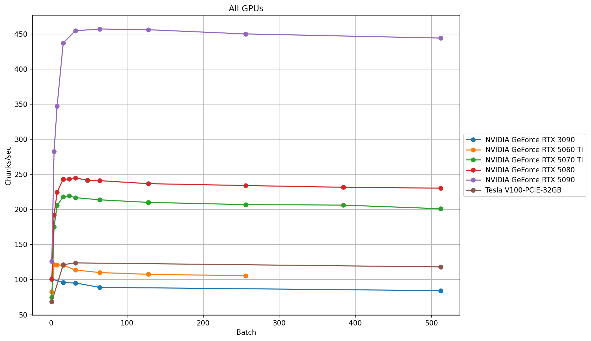

# E5 Base Embedding Benchmark

Benchmarking embedding throughput for `intfloat/multilingual-e5-base` on CPU and GPU.

## Goal

Measure embedding speed (chunks per second) across different hardware using:
- same dataset
- same model
- same pipeline

## Model

- `intfloat/multilingual-e5-base`
- backend: torch
- embedding size: 768
- dtype: float32

## Dataset

- total chunks: 117,800  
- average chunk length: ~160 words  
- estimated tokens per chunk: ~352 (coefficient ≈ 2.2)

## Method

- block-based embedding generation  
- block size: 5000  
- resume support  
- normalized embeddings
- backend: torch  
- block size: 5000  
- dataset size: 117,800 chunks  
- average chunk: ~160 words (~352 tokens)

## Results (batch = 32)

| Device | Chunks/s |
|--------|---------:|
| RTX 5090 | ~454 |
| RTX 5080 | ~245 |
| RTX 5070 Ti | ~216 |
| RTX 5060 Ti | ~114 |
| Tesla V100 | ~124 |
| RTX 3090 | ~95 |
| Ryzen 5 5625U (CPU) | ~3.0 |
| i5-4570 (CPU) | ~3.0 |

## CPU notes

CPU embedding performance was measured on full dataset runs:

- Ryzen 5 5625U: ~2.99 chunks/s  
- Intel i5-4570: ~3.03 chunks/s  

Observed range on full runs: **2.9 – 3.0 chunks/s**

Batch size for CPU tests: 128  
Backend: torch (CPU)

## Throughput comparison



## Notes

- throughput depends on batch size  
- optimal batch differs per GPU  
- CPU performance is significantly lower  

## Repository structure

## Run benchmark

```bash
pip install sentence-transformers torch numpy tqdm orjson

python scripts/block_embeddings_builder.py \
  --chunks chunks_gold.jsonl \
  --out-root out \
  --base-name test_run \
  --backend torch \
  --batch 32 \
  --block-size 5000 \
  --block-start 0 \
  --block-end -1
